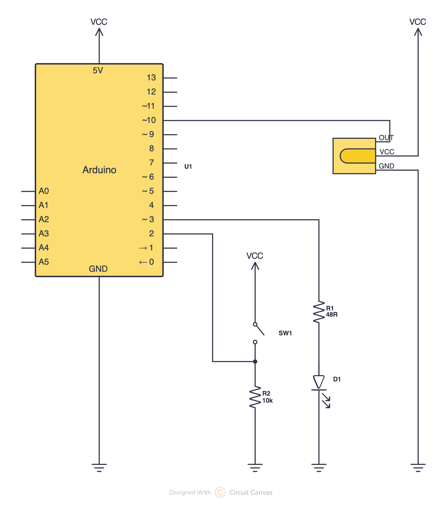
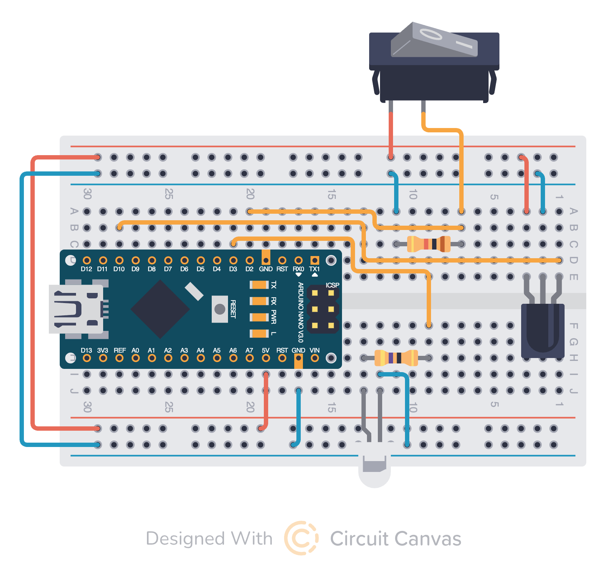

# Projector IR Controller

[](https://github.com/mt-krainski/projector-controller/actions/workflows/ci.yml)
[](LICENSE)


An Arduino-based infrared (IR) controller for the Dangbei N2 Smart Projector that automates power management and input selection sequences.

## Overview

This project addresses the inconvenience of managing multiple remotes in a home theater setup. The controller automates the process of turning the projector on/off and configuring it to the correct input device, eliminating the need for a separate projector remote.

## Problem Statement

In a typical setup with a Dangbei N2 Smart Projector, FireTV Stick, and FireTV Soundbar, users need multiple remotes:

- FireTV remote for FireTV Stick and soundbar control
- Projector remote for power management and input selection - it's not possible to use the FireTV remote for this because the projector remote has a different protocol (more info: https://www.reddit.com/r/projectors/comments/15r04dq/dangbei_ir_remote_code/)

This project consolidates projector control into a simple physical switch, automating common sequences like power on/off and HDMI input selection.

## Hardware Components

### Circuit Design

The project includes a custom Arduino circuit with:

- **Arduino Board**: Main microcontroller
- **TSOP38238 IR Receiver**: For recording IR codes from the original remote
- **950nm IR LED**: For sending IR signals to the projector
- **CdS Photoresistor**: Visible light photoresistor for checking the projector boot time
- **Physical Switch**: Manual trigger for power sequences
- **Status LED**: Visual feedback for operation status

### Circuit Documentation

The schematic was built using Circuit Canvas and can be found [here](https://circuitcanvas.com/p/x1f8y9dr6xvdkji8kt7?canvas=schematic).

#### Schematic



#### Layout



## Software Implementation

### Dependencies

- [Arduino IR Remote Library](https://github.com/Arduino-IRremote/Arduino-IRremote) v4.4.3 — IR signal transmission and reception

### Key Features

- **IR Code Recording**: Built-in recording mode using the Arduino IR Remote Library to capture all remote button codes
- **Sequenced Operations**: Implements sequence handling for power management and input selection
- **Boot Type Detection**: Performs output selection only on cold boot
- **Physical Interface**: Simple switch-based control with LED status indicators

### Functionality

#### Recording mode

To record IR codes from the original remote:

1. Uncomment the line `#define OPERATING_MODE_RECORDING` at the top of the Arduino sketch
2. Upload the code to the Arduino
3. Point the original remote at the TSOP38238 IR receiver
4. Press buttons on the remote to record their IR codes
5. The codes will be printed to the Serial Monitor in the format:
   ```
   Protocol=NEC Address=0x281 Command=0x1 Raw-Data=0xFE010281 32 bits LSB first
   Send with: IrSender.sendNEC(0x281, 0x1, <numberOfRepeats>);
   ```
6. Comment out the `#define OPERATING_MODE_RECORDING` line to return to normal operation

#### Normal mode

1. Power Off Sequence
   1. Sends POWER command
   2. Sends OK command to confirm shutdown dialog

2. Power On Sequence
   1. Sends POWER command
   2. Waits for sensor to pick up bright light (projector turns on)
   3. Determines boot type:
      1. If boot sequence took less than 10 seconds, we assume hot boot - no additional steps are necessary
      2. If boot sequence took more than 10 seconds, we assume cold boot. Perform additional sequence to select proper output:
         1. Navigates to HOME menu
         2. Selects HDMI input via UP/DOWN navigation
         3. Confirms selection with OK
      3. If boot sequence took more than 20 seconds, we assume error. Nothing happens

## IR Codes

The project includes comprehensive IR code mapping for the Dangbei N2 Smart Projector:

| Button      | Protocol | Address | Command | Raw Data   |
| ----------- | -------- | ------- | ------- | ---------- |
| POWER       | NEC      | 0x281   | 0x1     | 0xFE010281 |
| MUTE        | NEC      | 0x281   | 0x10    | 0xEF100281 |
| OK          | NEC      | 0x281   | 0x5     | 0xFA050281 |
| UP          | NEC      | 0x281   | 0x3     | 0xFC030281 |
| RIGHT       | NEC      | 0x281   | 0x6     | 0xF9060281 |
| LEFT        | NEC      | 0x281   | 0x4     | 0xFB040281 |
| DOWN        | NEC      | 0x281   | 0x7     | 0xF8070281 |
| HOME        | NEC      | 0x281   | 0x9     | 0xF6090281 |
| BACK        | NEC      | 0x281   | 0x8     | 0xF7080281 |
| VOLUME UP   | NEC      | 0x281   | 0xB     | 0xF40B0281 |
| VOLUME DOWN | NEC      | 0x281   | 0xC     | 0xF30C0281 |
| AUTOFOCUS   | NEC      | 0x281   | 0x14    | 0xEB140281 |
| NETFLIX     | NEC      | 0x281   | 0x58    | 0xA7580281 |
| SETTINGS    | NEC      | 0x281   | 0xA     | 0xF50A0281 |
| PRIME VIDEO | NEC      | 0x281   | 0x50    | 0xAF500281 |
| YOUTUBE     | NEC      | 0x281   | 0x55    | 0xAA550281 |

## Development Setup

I used an **Arduino Nano Every** for this project. The project includes a set of automation scripts to simplify the development workflow.

### Hardware

- **Board**: Arduino Nano Every (ATmega4809 processor)
- **FQBN**: `arduino:megaavr:nona4809`

### Development Scripts

The project includes several scripts in the `scripts/` directory to automate common development tasks:

#### Initial Setup

Install required dependencies; one time only:

```bash
./scripts/install-deps.sh
```

When starting to work on the project, discover and configure your Arduino board (i.e. run this after connecting the board to your computer):

```bash
./scripts/init.sh
```

The `init.sh` script automatically discovers your connected Arduino board and extracts the necessary port and board information. By default, it looks for boards matching "Arduino Nano Every", but you can specify a different board name as a parameter, e.g. `./scripts/init.sh "Arduino Uno"`.

#### Build and Upload

```bash
./scripts/build-and-upload.sh
```

Or run as individual steps:

```bash
./scripts/compile.sh
./scripts/upload.sh
```

The build process automatically uses the board information discovered by `init.sh` and provides detailed error messages if anything goes wrong.

#### Monitoring

```bash
./scripts/monitor.sh
```

This opens a serial monitor with the correct settings (115200 baud rate) to view debug output from the ProjectorController.

### Script Features

- **Automatic Board Discovery**: The `init.sh` script scans for connected Arduino boards and extracts port/FQBN information. This information is stored in `.board_port` and `.board_fqbn` files for use by other scripts.
- **Dependency Management**: The `install-deps.sh` script ensures all required libraries are installed
- **Error Handling**: All scripts provide clear error messages and troubleshooting tips
- **Connection Validation**: Scripts verify that the board is still connected before attempting operations
- **Serial Monitoring**: Easy access to debug output with proper configuration

**Notes**:

- During upload, you may see messages like `avrdude: jtagmkII_initialize(): Cannot locate "flash" and "boot" memories in description`. These are normal and can be ignored.

## Usage

1. **Setup**: Connect the circuit to your Arduino and upload the `src/ProjectorController/ProjectorController.ino` code
2. **Operation**: Flip the physical switch to trigger power on/off sequences
3. **Status**: The LED indicator provides visual feedback during operation — a few blinks when a sequence starts or finishes, and a single blink for each button press sent.

## Technical Details

- **IR Protocol**: NEC protocol with 32-bit data transmission
- **Frequency**: Standard IR frequency (38kHz)
- **Repeats**: 5 repeat transmissions for reliable signal reception
- **Timing**: Boot time is measured using a photoresistor
